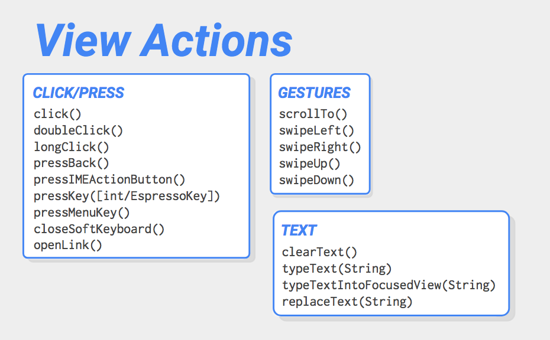
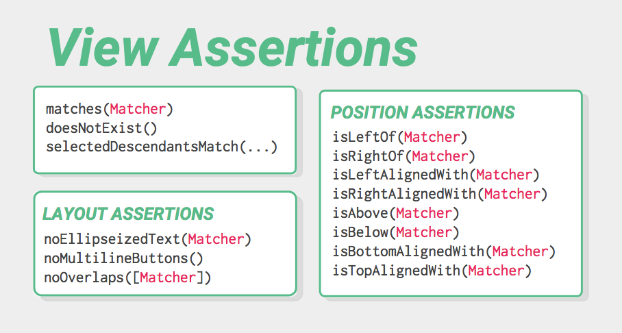

# Espresso

There are 6 types of annotations that can be applied to the methods used inside the test class,which are @Test, @Before, @BeforeClass, @After, @AfterClass, @Rule


Important things to note is that:

The activity will be launched using the @Rule before test code begins
By default the rule will be initialised and the activity will be launched(onCreate, onStart, onResume) before running every @Before method
Activity will be Destroyed(onPause, onStop, onDestroy) after running the @After method which in turn is called after every @Test Method
The activity’s launch can be postponed by setting the launchActivity to false in the constructor of ActivityTestRule ,in that case you will have to manually launch the activity before the tests

## Machers


Espresso uses onView (Matcher<View> viewMatcher) method to find a particular view among the View hierarchy. onView() method takes a Matcher as argument. Espresso provides a number of these ViewMatchers which can be found in this Espresso Cheat sheet.

Every UI element contains properties or attributes which can be used to find the element.Suppose for finding an element with

`android:id=“+id/login_button”`
We can write

`Espresso.onView(withId(R.id.login_button))`

## Performing actions on the View


`Espresso.onView(withId(R.id.login_button)).perform(click())`

## Checking the ViewAssertions

`Espresso.onView(withId(R.id.login_result)).check(matches(withText(R.string.login_success)))`

## Example 
```java
import android.support.test.rule.ActivityTestRule
import android.support.test.runner.AndroidJUnit4
import org.junit.runner.RunWith
import android.support.test.espresso.Espresso;
import android.support.test.espresso.action.ViewActions
import android.support.test.espresso.assertion.ViewAssertions.matches
import android.support.test.espresso.matcher.ViewMatchers.*

@RunWith(AndroidJUnit4::class)
class MainActivityInstrumentationTest {

    @Rule
    @JvmField
    public val rule  = ActivityTestRule(MainActivity::class.java)

    private val username_tobe_typed="Ajesh"
    private val correct_password ="password"
    private val wrong_password = "passme123"

    @Test
    fun login_success(){
        Log.e("@Test","Performing login success test")
        Espresso.onView((withId(R.id.user_name)))
                .perform(ViewActions.typeText(username_tobe_typed))

        Espresso.onView(withId(R.id.password))
                .perform(ViewActions.typeText(correct_password))

        Espresso.onView(withId(R.id.login_button))
                .perform(ViewActions.click())

        Espresso.onView(withId(R.id.login_result))
                .check(matches(withText(R.string.login_success)))
    }

    @Test
    fun login_failure(){
        Log.e("@Test","Performing login failure test")
        Espresso.onView((withId(R.id.user_name)))
                .perform(ViewActions.typeText(username_tobe_typed))

        Espresso.onView(withId(R.id.password))
                .perform(ViewActions.typeText(wrong_password))

        Espresso.onView(withId(R.id.login_button))
                .perform(ViewActions.click())

        Espresso.onView(withId(R.id.login_result))
                .check(matches(withText(R.string.login_failed)))
    }
}
```

```java
public void testActionBarOverflow() {
    // Make sure we hide the contextual action bar.
    onView(withId(R.id.hide_contextual_action_bar))
        .perform(click());

    // Open the options menu OR open the overflow menu, depending on whether
    // the device has a hardware or software overflow menu button.
    openActionBarOverflowOrOptionsMenu(
            ApplicationProvider.getApplicationContext());

    // Click the item.
    onView(withText("World"))
        .perform(click());

    // Verify that we have really clicked on the icon by checking
    // the TextView content.
    onView(withId(R.id.text_action_bar_result))
        .check(matches(withText("World")));
}
```
