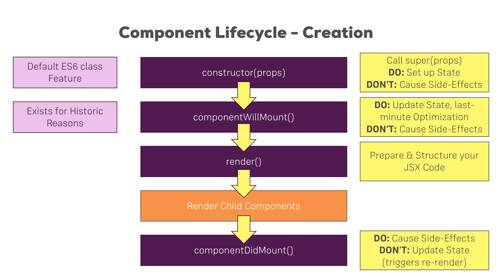
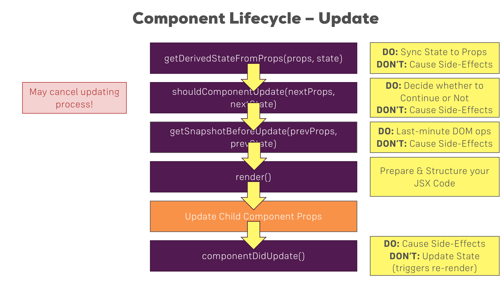

##Component lifecycle 

Every component in React goes through a lifecycle of events. I like to think of them as going through a cycle of birth, growth, and death.

Mounting – Birth of your component
Update – Growth of your component
Unmount – Death of your component

## Common React Lifecycle Methods
### render()
The render() method is the most used lifecycle method. You will see it in all React classes. This is because render() is the only required method within a class component in React.

## componentDidMount()
Now your component has been mounted and ready, that’s when the next React lifecycle method componentDidMount() comes in play

## componentDidUpdate()
This lifecycle method is invoked as soon as the updating happens. The most common use case for the componentDidUpdate() method is updating the DOM in response to prop or state changes.

## componentWillUnmount()
As the name suggests this lifecycle method is called just before the component is unmounted and destroyed. If there are any cleanup actions that you would need to do, this would be the right spot.

## Uncommon React Lifecycle Methods

## shouldComponentUpdate()
This lifecycle can be handy sometimes when you don’t want React to render your state or prop changes.
```javascript 
shouldComponentUpdate(nextProps, nextState)
```

## static getDerivedStateFromProps()
This will be a safer alternative to the previous lifecycle method componentWillReceiveProps().
It is called just before calling the render() method.
```javascript
static getDerivedStateFromProps(props, state) {
    if (props.currentRow !== state.lastRow) {
      return {
        isScrollingDown: props.currentRow > state.lastRow,
        lastRow: props.currentRow,
      };
    }
    // Return null to indicate no change to state.
    return null;
  }
  ```

## getSnapshotBeforeUpdate()
This will be a safer alternative to the previous lifecycle method componentWillUpdate().
```javascript
getSnapshotBeforeUpdate(prevProps, prevState) {
    // ...
  }
  // ->
  componentDidUpdate(prevProps, prevState, snapshot) {
  }
  ```
It is called right before the DOM is updated. The value that is returned from getSnapshotBeforeUpdate() is passed on to componentDidUpdate().
Keep in mind that this method should also be used rarely or not used at all.







